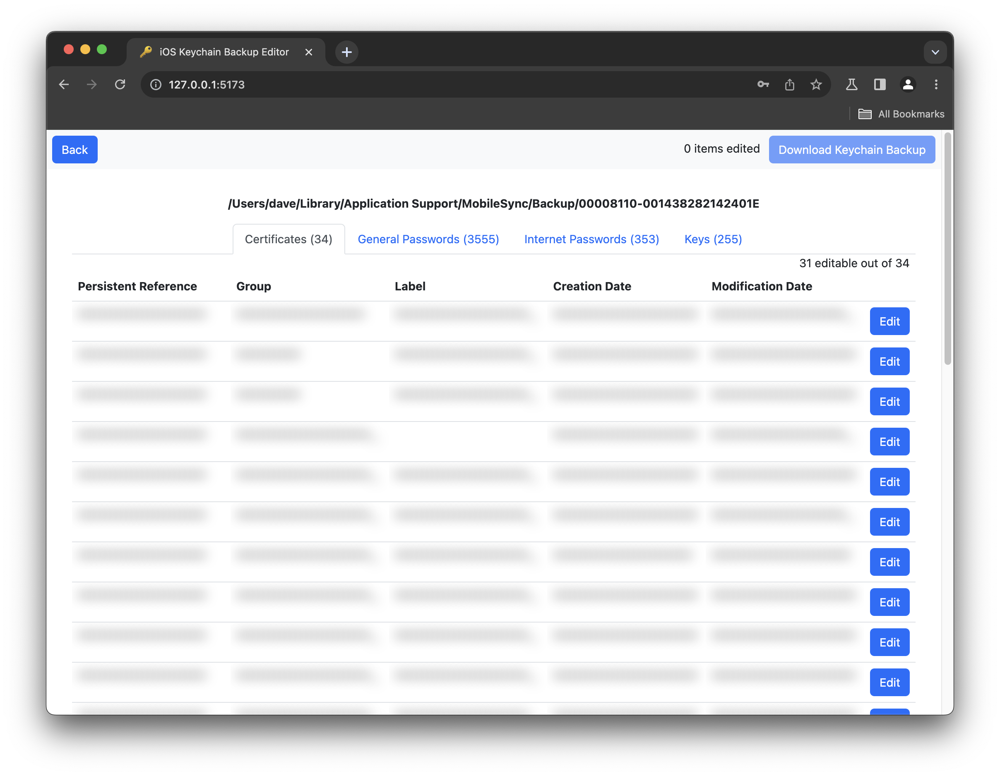

# iOS Keychain Backup Editor

  

Allows editing of the iOS keychain without a jailbreak by updating the `keychain-backup.plist` file of an encrypted backup.

This repository is a basic React frontend for [irestore](https://github.com/dnicolson/node-irestore) with a simple Node.js backend to stitch together various Keychain pieces. It’s beyond the scope of this project for now to re-encrypt the whole backup, the encrypted `keychain-backup.plist` file can be added to an encrypted backup with a tool like [iMazing](https://imazing.com/).

Not all Keychain items are editable as `ThisDeviceOnly` items are only able to be decrypted with the hardware `0x835` key which is unique to each device.

This technique was originally developed to allow [signing in to Feedly](https://gist.github.com/dnicolson/73c9f7359db9f61b3621a1e4918aa136) with Reeder 4 on older iOS devices.

## Running

1. `git clone git@github.com:dnicolson/iOSKeychainBackupEditor.git`
2. `cd iOSKeychainBackupEditor`
1. `npm install`
2. `npm run start`

## Editing a Keychain
1. Create an encrypted backup with iTunes/Finder or iMazing
2. Enter the absolute path and password into iOS Keychain Backup Editor
3. Make edits to the Keychain
4. Click "Download Keychain Backup"
5. Create an editable backup in iMazing of encrypted backup
6. Replace the `/KeychainDomain/keychain-backup.plist` file under "File System"
7. Restore backup

## License

MIT License.